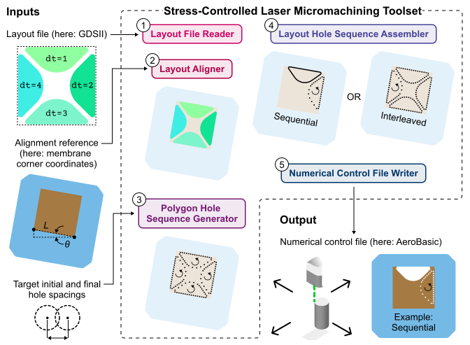
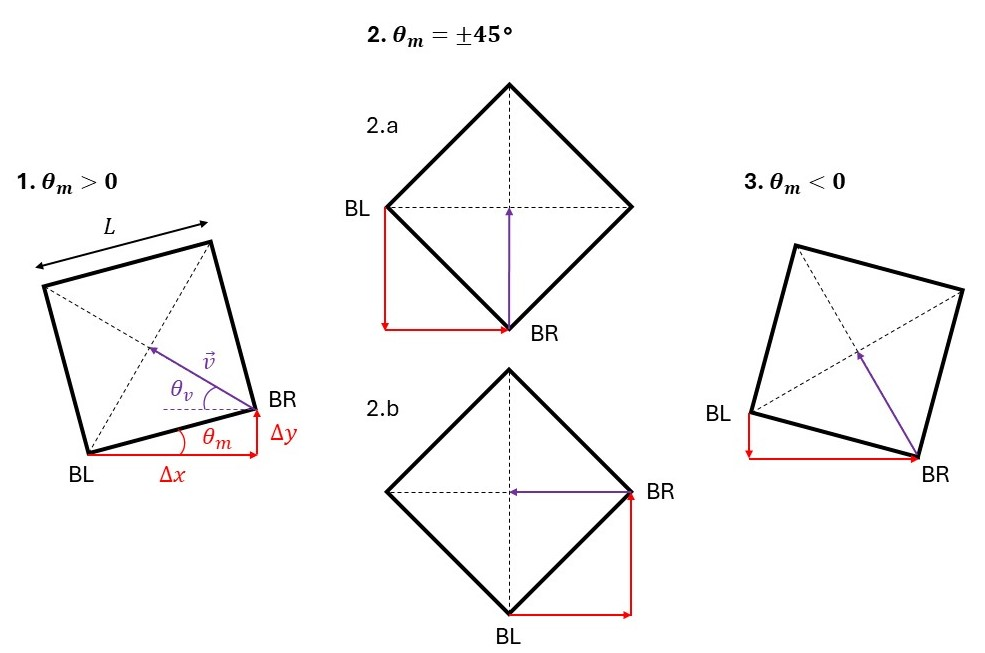

# Stress-Controlled Laser Micromachining Toolset (SCLMT)

[](https://arxiv.org/abs/xxx)
[](https://www.python.org)
[](LICENSE)

[Getting Started](#getting-started) |
[Length Units](#length-units) |
[GDSII File Requirements](#gdsii-file-requirements) |
[Aligning Layouts With Square Membranes](#aligning-layouts-with-square-membranes) |
[Sequential and Interleaved Layout Hole Sequence Assembly](#sequential-and-interleaved-layout-hole-sequence-assembly) |
[Configuring Stage and Laser](#configuring-stage-and-laser) |
[Authors and Contributors](#authors-and-contributors)

SCLMT is a Python package used for rapid prototyping of nanomechanical resonators via femtosecond laser ablation of pre-stressed silicon nitride membranes. It generates numerical control (NC) code for laser micromachining directly from layout designs.

A conceptual overview of the toolset is provided in our [arXiv paper](https://arxiv.org/abs/XXXX.XXXXX).

<p align="center">
  
  <br/>
  <em>Schematic of SCLMT</em>
</p>

SCLMT comprises a pipeline of five tools:

1. `LayoutFileReader` extracts geometric elements from a layout file and converts them into polygons
2. `LayoutAligner` transforms the layout to align with the substrate
3. `PolygonHoleSequenceGenerator` creates a coordinate list defining the sequence of laser-ablated holes used to cut out an individual polygon
4. `LayoutHoleSequenceAssembler` combines all polygon hole sequences into a single layout-wide sequence
5. `NumericalControlFileWriter` converts the layout hole sequence into a numerical control file for a translation stage and laser

All tools except `PolygonHoleSequenceGenerator` are defined as interfaces (abstract classes), allowing for multiple concrete implementations. The package includes at least one built-in implementation for each tool. See `interfaces.py` for tool definitions.

## Getting Started

To get started, clone the repository (or download it as ZIP) and install the required dependencies as shown below:

1. Clone the repository:
   ```bash
   git clone https://github.com/yayosaleh/sclmt.git
   cd sclmt
   ```
2. Install dependencies:
   ```bash
   pip install -r requirements.txt
   ```
3. Ensure the `sclmt` folder is in your working directory to import the package.

<p></p>

Using SCLMT involves building a pipeline with injected tool implementations that define how a layout is processed and converted into NC code.

For example, to generate an AeroBasic program from a GDSII layout using the built-in tool implementations:

```python
from sclmt import (
    # Built-in tool implementations
    GDSFileReader,
    MembraneCornerLayoutAligner,
    SequentialLayoutHoleSequenceAssembler,
    InterleavedLayoutHoleSequenceAssembler,
    AeroBasicFileWriter,
    # Pipeline
    LayoutToNumericalControlPipeline,
)

# Build pipeline
pipeline = LayoutToNumericalControlPipeline()
(pipeline
    # Set layout to be laser machined from GDSII file
    .read_layout_file(GDSFileReader("in.gds"))
    # Align layout with stage-mounted square membrane
    .align_layout(MembraneCornerLayoutAligner(
        nominal_membrane_side_length = 1200,
        bottom_left_to_right_x = 1182,
        bottom_left_to_right_y = 208
    ))
    # Generate polygon hole sequences and assemble layout hole sequence
    # Alternatively, use InterleavedLayoutHoleSequenceAssembler for interleaved execution
    .generate_hole_sequence(SequentialLayoutHoleSequenceAssembler())
    # Write layout hole sequence to numerical control file
    .write_numerical_control_file(AeroBasicFileWriter("out.pgm"))
)

# Write log to file
# Alternatively, print log using print(pipeline.get_log())
pipeline.write_log_to_file("log.txt")
```

`LayoutToNumericalControlPipeline` features additional methods for lower level control. The following example demonstrates how to define a layout from raw polygons, apply transformations, configure hole spacing on a per-polygon basis, visualize the resulting layout and hole sequence, and finally write a NC file using a custom `NumericalControlFileWriter`.

```python
from sclmt import (
    # Built-in tool implementations
    SequentialLayoutHoleSequenceAssembler,
    InterleavedLayoutHoleSequenceAssembler,
    # Tool interface
    NumericalControlFileWriter,
    # Pipeline
    LayoutToNumericalControlPipeline,
)

# Implement a custom NumericalControlFileWriter (toy example)
class MyNumericalControlFileWriter(NumericalControlFileWriter):
    def __init__(self, filename: str) -> None:
        super().__init__()
        self.filename = filename
        self.commands: list[str] = []

    def get_length_unit(self) -> float:
        return 1e-6
    
    def add_hole(self, x: float, y: float) -> None:
        self.commands.append(f"MOVE STAGE TO X {x} Y {y}")
        self.commands.append(f"FIRE LASER")
    
    def write_file(self) -> None:
        with open(self.filename, "w") as f:
            f.write("\n".join(self.commands))
        self.log(f"File path/name: {self.filename}")

# Build pipeline
pipeline = LayoutToNumericalControlPipeline()
(pipeline
    # Set layout to be laser machined from list of polygons
    .set_polygons([
        # Triangle
        [[-5, 1], [-1, 1], [-5, 5]],
        # Square
        [[1, 1], [1, 5], [5, 5], [5, 1]]
    ])
    
    # Apply layout transformations
    # View layout before and after transformations
    .view_layout()
    .translate_layout(dx = 5, dy = -1)
    .scale_layout(scaling_factor_x = 2, scaling_factor_y = 2)
    .rotate_layout(angle_rad = 0.1745)
    .view_layout()
    
    # Find optimal initial hole spacing for triangle using min of 1
    # Impose target initial hole spacing of 2 on square
    # Impose target final hole spacing of 0.7 on both polygons
    .set_hole_spacing(
        min_initial_hole_spacing = [1, None],
        target_initial_hole_spacing = [None, 2],
        target_final_hole_spacing = 0.7
    )
    .generate_hole_sequence(InterleavedLayoutHoleSequenceAssembler())
    
    # View animation of hole sequence
    # Using per_polygon = True to view polygon hole sequences individually
    .view_hole_sequence(per_polygon = True, animation_interval_ms = 100)

    # Write numerical control file using custom tool implementation
    .write_numerical_control_file(MyNumericalControlFileWriter("out.nc"))
)
```

Hole spacings must be defined before generating hole sequences, but calling `set_hole_spacing()` is optional. If it's not called, default values for the minimum initial and target final spacings from `config.py` are applied, and the optimal initial spacing for each polygon is computed automatically when `generate_hole_sequence()` is called.

## Length Units

- All length units are represented as scaling factors relative to meters (e.g., `1e-6` → μm)
- The `WORKING_LENGTH_UNIT` in `config.py` defines the unit used throughout the pipeline
    - The layout and hole sequence are stored in this unit
    - Arguments to `set_polygons()`, `translate_layout()`, `set_hole_spacing()`, and `MembraneCornerLayoutAligner()` must use this unit
    - Automatic unit conversions are performed when `read_layout_file()` and `write_numerical_control_file()` are called

## GDSII File Requirements

- Files must be composed of a single flat cell (i.e., with no references to other cells)
- Each geometric element to be machined must have its `layer` property set to 0 and its `datatype` property set to the order in which it is machined (e.g., `datatype = 1` indicates first to be machined)
- Contact between polygons should be avoided since this causes unnecessary machining of shared edges; a single equivalent polygon should be used instead
- If you intend to use `MembraneCornerLayoutAligner`, the layout must be centered at (0,0)

## Aligning Layouts With Square Membranes

`MembraneCornerLayoutAligner` allows users to align a layout with a stage-mounted square membrane using the measured displacement from the bottom-left to bottom-right corner. Initially, the layout must be centered at (0,0). After the layout is aligned, its origin will be in the bottom-right corner, where the stage must be zeroed.

<p align="center">
  
  <br/>
  <em>Alignment Diagram</em>
</p>

**Symbols:**

- $L$: actual membrane side length
- $\Delta x, \Delta y$: displacement from bottom left to bottom right corner
    - $\theta_{m}$: membrane angle
- $\vec{v}$: vector from bottom right corner to the membrane center
    - $\theta_{v}$: angle of $\vec{v}$

**Cases:**

1. $\Delta x, \Delta y > 0, \theta_{m} > 0$
2. $\theta_{m}=\pm45$°, depending on which corners are chosen
3. $\Delta x > 0, \Delta y < 0, \theta_{m} < 0$

**Properties:**

- $-45°≤\theta_{m}≤45°$ or else the wrong corners were chosen
- If not zero, $v_x$ is always negative, and $v_y$ is always positive
- $cos(\theta_{v}), sin(\theta_{v}) >  0\ \forall\ \theta_{m}$, hence the negative sign associated with $v_x$

## Sequential and Interleaved Layout Hole Sequence Assembly

`SequentialLayoutHoleSequenceAssembler` simply concatenates polygon hole sequences.

With `InterleavedLayoutHoleSequenceAssembler`, pass $i$ of the layout hole sequence is the union of pass $i$ of all polygon hole sequences.

<p align="center">
  <table>
    <tr>
      <td align="center">
        <br/>
        <em>Sequential Execution</em>
      </td>
      <td align="center">
        <br/>
        <em>Interleaved Execution</em>
      </td>
    </tr>
  </table>
</p>

## Configuring Stage and Laser

`AeroBasicFileWriter` can be configured via constructor arguments, which include stage and laser parameters. The `transition_feedrate_reduction_...` arguments are used to slow down the stage whenever it traverses a distance larger than a given threshold. Only `filename` is required, all other parameters fall back to defaults if omitted.

```python
AeroBasicFileWriter(
    filename = "out.pgm",
    transition_feedrate = 0.2,
    shape_feedrate = 0.2,
    transition_feedrate_reduction_enabled = False,
    transition_feedrate_reduction_distance_threshold_mm = 300 / 1000,
    transition_feedrate_reduction_factor = 3,
    pulse_num = 3,
    frequency_Hz = 200000
)
```

## Authors and Contributors

This package was developed by Yahya Saleh, with design feedback and feature suggestions from  Zachary Louis-Seize and Mohammed Shakir.